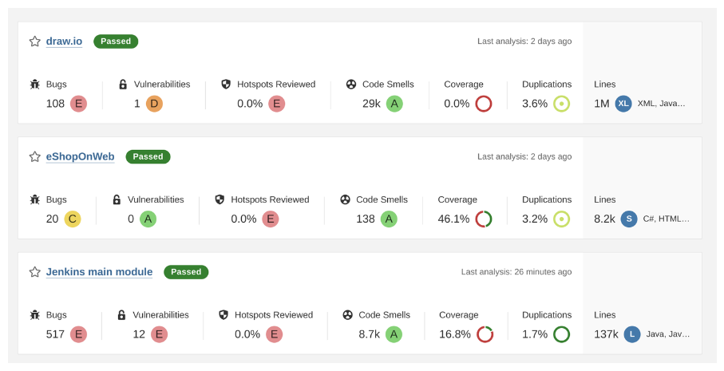

# ASA Lab SonarQube

In this Lab we are working with [SonarQube](https://www.sonarsource.com/products/sonarqube/) and use it to analyze Software Projects. SonarQube is very widely used and provides software metrics derived from [static code analysis](https://owasp.org/www-community/controls/Static_Code_Analysis). Please note that there are other solutions available performing similar activities as well.

<hr/>

## 1. Requirements

We are going to work with a locally installed version of SonarQube. There are a couple of options to startup a local instance. Either download a specific released version from the SonarQube homepage or use a docker-compose file to startup an instance.

### 1.1 Java

We need an installed java version for SonarQube and also for the software examples we are going to analyze. It is very much recommended to use a **LTS OpenJDK** version. Go to https://adoptium.net/ to download the current java LTS version **Open-JDK-17**.

### 1.2 .NET

The .NET version of Microsoft is available for a number of different platforms (Windows, Mac, Linux) and can be freely downloaded and installed. .NET also uses a LTS approach. The current LTS version is .NET 6.0. Our .NET example uses the current version which is .NET 7.0. Head over to https://dotnet.microsoft.com/en-us/download and install the current version **.NET 7.0**.

### 1.3 SonarQube Installation

#### 1.3.1 SonarQube standalone instance

We will use the 'Community Edition' because it can be used freely without the need for any payment. Download this version from the page https://www.sonarsource.com/products/sonarqube/downloads/.

Unpack to downloaded archive to a working directory. Change into directory `./sonarqube-9.9.xx/bin` and use the folder for your specific OS (linux, mac, win). 
Within the OS-specific folder start SonarQube in `console mode`.

```bash
# linux/mac
./sonar.sh console

# output
/usr/bin/java
Running SonarQube...
Removed stale pid file: ./SonarQube.pid
...
2023.03.26 14:58:43 INFO  app[][o.s.a.SchedulerImpl] Process[ce] is up
2023.03.26 14:58:43 INFO  app[][o.s.a.SchedulerImpl] SonarQube is operational
```

#### 1.3.2 SonarQube as a container

If your OS is capable of running containers, SonarQube does not need to be downloaded, starting the SonarQube container image is sufficient to run a local instance.

SonarQube has documentation of running a container version: https://github.com/SonarSource/docker-sonarqube/blob/master/examples.md

First create a local folder where SonarQube will store data, logs and its configuration. 

```bash
# linux/mac
mkdir -p ./sonardata/data && mkdir -p ./sonardata/extensions && mkdir -p ./sonardata/logs

# windows
# use Explorer.exe ;)
```

The following commands will start the SonarQube container (the 'Community Edition' version 9.9).

```bash
# linux/mac
docker run \
    -v $(PWD)/sonardata/data:/opt/sonarqube/data \
    -v $(PWD)/sonardata/extensions:/opt/sonarqube/extensions \
    -v $(PWD)/sonardata/logs:/opt/sonarqube/logs \
    --name="sonarqube" -p 9000:9000 sonarqube:9.9-community
```

The same can be achieved by using a docker compose file like the following.

```yaml
# compose.yaml
version: "3"
services:
  sonarqube:
    image: sonarqube:9.9-community
    container_name: sonarqube
    volumes:
      - ./sonardata/data:/opt/sonarqube/data
      - ./sonardata/extensions:/opt/sonarqube/extensions
      - ./sonardata/logs:/opt/sonarqube/logs
    ports:
      - "9000:9000"
```

To run the compose file execute the following command:

```bash
docker-compose -f compose.yaml up

# output
[+] Running 1/1
 ⠿ Container sonarqube  Created                                                       0.1s
Attaching to sonarqube
...
sonarqube  | 2023.03.26 13:31:31 INFO  app[][o.s.a.SchedulerImpl] SonarQube is operational
```

### 1.4 Sonar Scanner

SonarQube provides a couple of convenient scanners for common technologies or integrations (Gradle, Maven, ant, .NET, AzureDevops, Jenkins). If the project to analyze does not fall within this range of "predefined integrations" the standalone [Sonar Scanner](https://docs.sonarqube.org/latest/analyzing-source-code/scanners/sonarscanner/) can be used.

Again there are two possibilities to run the Scanner - download the **zip-file**. Download the OS-specific version or the JVM only version and extract the Scanner into a local directory.

### 1.5 Maven build tool

We need Maven for one of the projects we are analyzing. Specifically we need a recent version >= **3.8.1**. Go to the [Maven download](https://maven.apache.org/download.cgi) page and install the correct version.

### 1.6 Ant build tool

One of the projects we are going to analyze uses the [ant build system](https://ant.apache.org/). Follow the instructions to install ant - https://ant.apache.org/bindownload.cgi.

<hr/>

## 2. Analyze Projects

We are going to analyze Open-Source projects and interpret the scan results / metrics.

- Draw.io - Online Diagram application (Java and Javascript)
- eShopOnWeb - Reference .NET application implementing a Shop example (.NET)
- Jenkins - Well known build server (Java and Javascript)

With this projects we see the different integration possibilities of SonarQube and the coverage of different technology.

### 2.1 draw.io

[Draw.io](https://github.com/jgraph/drawio) is a very useful diagram application which can be described as "Microsoft Visio in the Web-Browser". The github page explains draw.io

> draw.io is a JavaScript, client-side editor for general diagramming and whiteboarding

To analyze the application the following steps need to be performed:

1. Ensure the local SonarQube instance is running - http://localhost:9000
2. Create a new SonarQube project in **manual mode**
3. Enter data DisplaName / Key = `draw.io`
4. Click Analyze project **Locally**
5. Create a token
6. Analyze with **other build** option
7. Select your OS
8. clone the git repository to local folder https://github.com/jgraph/drawio.git (INFO - commit#: `8d9a9926`)
9. change into the local folder of the cloned repository (e.g. ./drawio)
10. change to build folder `./etc/build`
11. build the project with `ant` and `ant javac` (optional set `JAVA_HOME` for ant to work properly)
12. run the installed `sonar-scanner` in the root-folder the draw.io src (NOTE: use relative path to the sonar-scanner location)

```bash
sonar-scanner -Dsonar.projectKey=draw.io \
    -Dsonar.sources=./src \
    -Dsonar.host.url=http://localhost:9000 \
    -Dsonar.login=<generated-sonar-key> \
    -Dsonar.java.binaries=./src/main/webapp/WEB-INF/classes

```

13.  Review the imported analyzes results within the SonarQube instance.

### 2.2 dotnet-architecture/eShopOnWeb

The [eShopOnWeb](https://github.com/dotnet-architecture/eShopOnWeb) application demonstrates a best-practice approach for ASP.NET applications by implementing a sample shop/e-commerce solution.

> Sample ASP.NET Core reference application, powered by Microsoft, demonstrating a single-process (monolithic) application architecture and deployment model. 

The steps to analyze the application are very similar to the example of draw.io. Just the last steps differ, because there is a dotnet integration option.

1. Ensure the local SonarQube instance is running - http://localhost:9000
2. Create a new SonarQube project in **manual mode**
3. Enter data DisplaName / Key = `eShopOnWeb`
4. Click Analyze project **Locally**
5. Create a token
6. Analyze with **.NET** option
7. Choose build tool **.NET core**
8. Install the sonar scanner as a dotnet-tool `dotnet tool install --global dotnet-sonarscanner`
9. clone the git repository to local folder https://github.com/dotnet-architecture/eShopOnWeb.git (INFO - commit#: `8d9a917`)
10. change into the local folder of the cloned repository (e.g. ./eShopOnWeb)
11. Restore the necessary packages `dotnet restore Everything.sln`
12. Start sonar-scanner and build

```bash
dotnet sonarscanner begin \
  /k:"eShopOnWeb" \
  /d:sonar.host.url="http://localhost:9000" \
  /d:sonar.login="<generated-sonar-key>"

dotnet build Everything.sln

dotnet sonarscanner end /d:sonar.login="<generated-sonar-key>"
```

13. Review the imported analyzes results within the SonarQube instance.


#### 2.2.1 Add test-coverage

The sample application provides a number of tests, the test-results can be imported to SonarQube and help to improve the overall analysis. To import the the coverage information the following steps are needed.

1. Install the `dotnet-coverage` tool - `dotnet tool install --global dotnet-coverage`
2. Prep the sonar-scanner tool to also consider test-coverage; build and execute the unit-tests

```bash
dotnet sonarscanner begin \
  /k:"eShopOnWeb" \
  /d:sonar.host.url="http://localhost:9000" \
  /d:sonar.login="<generated-sonar-key>" \
  /d:sonar.cs.vscoveragexml.reportsPaths=coverage.xml

dotnet build Everything.sln --no-incremental
dotnet-coverage collect "dotnet test Everything.sln" -f xml -o "coverage.xml"

dotnet sonarscanner end /d:sonar.login="<generated-sonar-key>"
```

3. Review the imported analyzes results within the SonarQube instance.


### 2.3 Jenkins CI Server

[Jenkins](https://github.com/jenkinsci/jenkins) is a well known build-server which is very widely used. It is Java based, Open-Source and can be freely used to setup your own build-environment.

> In a nutshell, Jenkins is the leading open-source automation server. Built with Java, it provides over 1,800 plugins to support automating virtually anything, so that humans can spend their time doing things machines cannot.

To analyze the source of Jenkins additional parameters are needed, apart from the description given during the SonarQube setup. Apart from the parameters no additional tools are needed, except for a recent (>= 3.8.1) Maven version.

1. Ensure the local SonarQube instance is running - http://localhost:9000
2. Create a new SonarQube project in **manual mode**
3. Enter data DisplaName / Key = `jenkins`
4. Click Analyze project **Locally**
5. Create a token
6. Analyze with **.Maven** option
7. clone the git repository to local folder https://github.com/jenkinsci/jenkins.git (INFO - commit#: `319dfc6134`)
8. change into the local folder of the cloned repository (e.g. ./jenkins)
9. Start maven with goal sonar

```bash
mvn clean verify sonar:sonar \
  -Dmaven.test.failure.ignore=true \
  -Plight-test \
  -Penable-jacoco \
  -Dsonar.coverage.jacoco.xmlReportPaths=${PWD}/coverage/target/site/jacoco-aggregate/jacoco.xml \
  -Dsonar.projectKey=jenkins \
  -Dsonar.host.url=http://localhost:9000 \
  -Dsonar.login=<generated-sonar-key>
```

10. Review the imported analyzes results within the SonarQube instance.

**NOTE**: A short explanation of the additional parametersl

- **-Dmaven.test.failure.ignore** -> If the full tests are executed, continue even if one test fails
- **-Plight-test** -> Do not execute ALL tests to be faster. A full test-run takes more than a [hour!]( https://github.com/jenkinsci/jenkins/blob/master/CONTRIBUTING.md#testing-changes)
- **-Penable-jacoco** -> Collect coverage information with [Jacoco](https://www.jacoco.org/jacoco/)
- **-Dsonar.coverage.jacoco.xmlReportPaths** -> The path of the combined Jacoco coverage data.
- -Dsonar.projectKey, -Dsonar.host.url, -Dsonar.login --> Std parameters for SonarQube.


<hr/>

After all projects are imported the SonarQube results will look similar to this:

